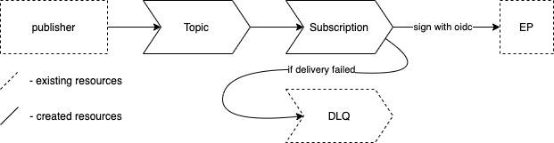

# Module to deliver payload to push EP with PubSub (and retries!).



Featuring:

- retries (circuit breaker)
- dead letter queue
- OIDC auth (secure: signed headers)
- payload schema validation (AVRO)

## TODO
- event-recorder function (persist_policy)
- debug mode for event-recorder
- make DLQ optional

# Schema Validation
To enable **schema validation** - you need to set `input_schema_definition_string` to non-empty string, containing [AVRO schema](https://avro.apache.org/docs/current/spec.html#json_encoding).
For example:
```shell
schema_definition_string = file("schema.json")
```
for example of [AVRO schema](https://avro.apache.org/docs/current/spec.html#json_encoding) see [schema-example.json](schema-example.json)

**Attention!** To **ADD** or **REMOVE** schema - you have to **recreate** the **Topic**!
Otherwise, you'll get:
```shell
Error: Error updating Topic "...": googleapi: Error 400: Invalid update_mask provided in the UpdateTopicRequest: the 'schema_settings' field in the Topic is not mutable.
```

<!-- BEGIN_TF_DOCS -->
## Requirements

No requirements.

## Providers

| Name | Version |
|------|---------|
| google | n/a |

## Inputs

| Name | Description | Type | Default | Required |
|------|-------------|------|---------|:--------:|
| project | Google Cloud project | `string` | n/a | yes |
| push_entry_point | Entry point to deliver payload to | `string` | n/a | yes |
| name | Name of the MAIN topic to send payload to AND of subscription | `string` | n/a | yes |
| dlq_topic_name | Name of EXISTING DLQ topic | `string` | n/a` | yes |
| pubsub_service_account | e-mail of PubSub SA (should look like 'service-<project_id>@gcp-sa-pubsub.iam.gserviceaccount.com') | `string` | n/a | yes |
| publisher_service_account | e-mail of Publisher. For k8s services it can be workloads SA (may look like <project_id>-compute@developer.gserviceaccount.com) | `string` | n/a | yes |
| max_delivery_attempts | before sending to DLQ | `number` | 5 | no |
| ack_deadline_seconds | before marking as "unacknowledged" | `number` | 10 | no |
| message_retention_duration | message retention duration (max 604800s) | `string` | 604800s | no |
| retry_policy | @see [terraform object definition](https://registry.terraform.io/providers/hashicorp/google/latest/docs/resources/pubsub_subscription#retry_policy) | `list(object)` | { minimum_backoff = "5s" maximum_backoff = "60s" } | no |
| labels | Labels to attach to all related objects | `map(string)` | `{}` | no |

## Outputs

| Name | Description |
|------|-------------|
| url | Cloud Function EP |
| version | Version of build (likely, short commit) |
<!-- END_TF_DOCS -->
